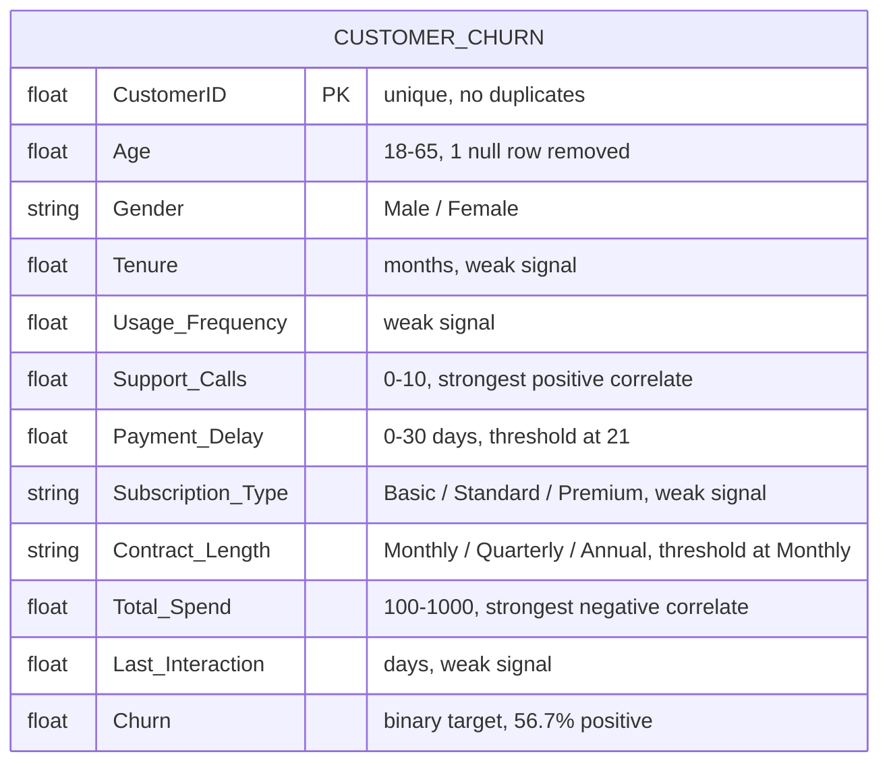
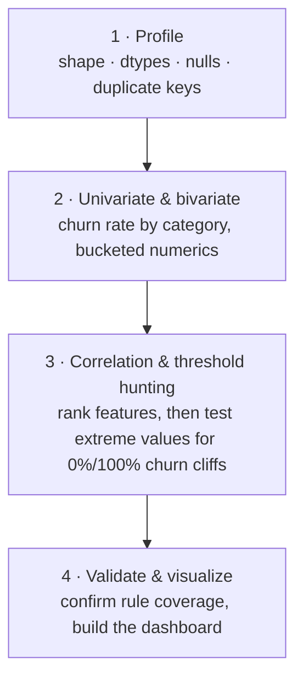

# Customer Churn — Exploratory Data Analysis & Interactive Dashboard

**An exploratory audit of 440,832 customer records that uncovered a hidden rule structure behind the churn label: four simple thresholds — Monthly contract, Age ≥ 55, Support Calls ≥ 6, Payment Delay ≥ 21 days — each drive churn to exactly 100%, while customers who trip none of them churn at only 16.9%.**

[](https://www.python.org/)
[](https://pandas.pydata.org/)
[](https://numpy.org/)
[](https://www.chartjs.org/)
[](https://4maxr.github.io/customer-churn-eda-dashboard/)
[](#findings-register)

---

## Navigation

- [Executive Summary](#executive-summary)
- [The Business Problem](#the-business-problem)
- [Dataset Overview](#dataset-overview)
- [Method](#method)
- [Findings Register](#findings-register)
- [Deep Dives](#deep-dives)
  - [1 · Four thresholds that fully determine churn](#1--four-thresholds-that-fully-determine-churn)
  - [2 · Support Calls is the strongest gradient signal](#2--support-calls-is-the-strongest-gradient-signal)
  - [3 · Total Spend separates retained customers cleanly](#3--total-spend-separates-retained-customers-cleanly)
  - [4 · Gender shows an unexplained split](#4--gender-shows-an-unexplained-split)
  - [5 · Subscription Type and Tenure carry almost no signal](#5--subscription-type-and-tenure-carry-almost-no-signal)
- [What Is Actually Clean](#what-is-actually-clean)
- [The Interactive Dashboard](#the-interactive-dashboard)
- [Limitations & Uncertainty](#limitations--uncertainty)
- [Recommendations](#recommendations)
- [Reproducing This Project](#reproducing-this-project)
- [Project Structure](#project-structure)
- [Skills This Project Demonstrates](#skills-this-project-demonstrates)
- [Author](#author)

**Live dashboard:** [4maxr.github.io/customer-churn-eda-dashboard](https://4maxr.github.io/customer-churn-eda-dashboard/) · **Other documents:** [Dashboard source (churn_dashboard.html)](churn_dashboard.html)

---

## Executive Summary

The dataset arrived as a standard "customer churn" table — one row per customer,
a binary `Churn` label, and eleven candidate predictors. On the surface it looks
like a typical churn-modelling exercise. It isn't.

Once the numeric features are bucketed and cross-tabulated against `Churn`, four
non-overlapping thresholds emerge that each drive the churn rate to **exactly
100%** — not "high", not "elevated", exactly 100%, with zero exceptions across
tens of thousands of rows per rule. That is not the shape of organic customer
behaviour; it is the signature of a **rule-generated (very likely synthetic)
label**.

|       | Finding                                                                                                                                                                                                    | Consequence                                                                                                                                                                                        |
| ----- | ---------------------------------------------------------------------------------------------------------------------------------------------------------------------------------------------------------- | -------------------------------------------------------------------------------------------------------------------------------------------------------------------------------------------------- |
| **1** | **Four independent thresholds each drive churn to 100%**: `Contract Length = Monthly` (87,104 rows), `Age ≥ 55` (54,425 rows), `Support Calls ≥ 6` (94,613 rows), `Payment Delay ≥ 21 days` (84,030 rows). | Churn is largely _deterministic_, not probabilistic, for ~48% of the base. A model doesn't need to learn a gradient here — it needs to learn a lookup table.                                       |
| **2** | **Customers who trigger none of the four thresholds churn at only 16.9%**, versus 100% for the 211,165 who trigger at least one.                                                                           | The real predictive question is narrower than the raw correlations suggest: most of the apparent signal in `Age`, `Support Calls`, and `Payment Delay` is threshold behaviour, not a smooth trend. |
| **3** | **Retained customers never fall below $500 in `Total Spend`**; churned customers range the full $100–1,000. `Total Spend` is the strongest single correlate after the rule features (r = −0.43).           | A simple spend floor is almost as informative as some of the modelled features, and should be checked before any feature-engineering effort.                                                       |

The remaining columns — `Usage Frequency`, `Tenure`, `Last Interaction`,
`Subscription Type` — carry weak or negligible correlation with churn on their own.

> [!IMPORTANT]
> **The honest read.** This dataset is well suited for practicing classification
> techniques (a shallow decision tree will score extremely well by encoding the
> four thresholds above), but the near-perfect separability means it should not be
> treated as a realistic model of customer behaviour, and any business narrative
> drawn from it (e.g. "female customers churn more") should be treated as a
> property of this file, not a validated real-world insight.

**Headline numbers**

| Metric                                       | Value                                       |
| -------------------------------------------- | ------------------------------------------- |
| Rows in source file                          | 440,833                                     |
| Fully blank rows removed                     | 1                                           |
| Rows analyzed                                | 440,832                                     |
| Duplicate `CustomerID`s                      | 0                                           |
| Missing values (after blank-row removal)     | 0                                           |
| Overall churn rate                           | 56.71% (249,999 churned / 190,833 retained) |
| Rule-triggered rows (≥1 of the 4 thresholds) | 211,165 (47.9%) — 100% churn                |
| Non-rule rows                                | 229,667 (52.1%) — 16.9% churn               |
| Strongest correlate                          | `Support Calls`, r = 0.574                  |
| Strongest negative correlate                 | `Total Spend`, r = −0.429                   |

---

## The Business Problem

The brief was open-ended: _"analyse this churn dataset."_ That framing hides a
choice — do you jump straight to feature engineering and a classifier, or do you
first establish **what kind of dataset this actually is?**

Three questions were used to scope the work before any modelling was considered:

1. **Is the churn label smooth or rule-driven?** A smooth label rewards feature
   engineering and model tuning. A rule-driven label rewards finding the rules —
   modelling on top of it without knowing this produces a model that looks
   accurate but has learned nothing generalizable.
2. **Which features actually separate the classes, and which just look like they
   do in aggregate?** Aggregate correlation can be misleading when a feature's
   relationship with the target is a step function rather than a trend (see
   `Age`, where the aggregate r = 0.22 is really just one age-band cliff-edge,
   not a gradual risk increase).
3. **Is the data clean enough to trust at face value?** Nulls, duplicate IDs, and
   out-of-range values all need to be ruled out before any of the above findings
   can be trusted.

Answering question 1 is what turned a routine EDA into the headline finding of
this project.

---

## Dataset Overview

One CSV, ~22.4 MB, 440,833 rows, one row per customer.

| Table                                        | Grain                | Rows                             | Key          |
| -------------------------------------------- | -------------------- | -------------------------------- | ------------ |
| `customer_churn_dataset-training-master.csv` | one row per customer | 440,833 (440,832 after cleaning) | `CustomerID` |



**Column dictionary**

| Column              | Type   | Notes                                               |
| ------------------- | ------ | --------------------------------------------------- |
| `CustomerID`        | float  | unique identifier, no duplicates found              |
| `Age`               | float  | 18–65                                               |
| `Gender`            | string | Male / Female                                       |
| `Tenure`            | float  | months as customer                                  |
| `Usage Frequency`   | float  | activity count                                      |
| `Support Calls`     | float  | 0–10; ≥6 always churns                              |
| `Payment Delay`     | float  | 0–30 days; ≥21 always churns                        |
| `Subscription Type` | string | Basic / Standard / Premium                          |
| `Contract Length`   | string | Monthly / Quarterly / Annual; Monthly always churns |
| `Total Spend`       | float  | $100–$1,000; retained customers never below $500    |
| `Last Interaction`  | float  | days since last interaction                         |
| `Churn`             | float  | binary target, 0/1, 56.71% positive                 |

---

## Method

Four passes, one purpose each — profile, correlate, threshold-hunt, visualize.



**Techniques that did the real work**

- **Bucket before you correlate.** A Pearson correlation on `Age` alone (r = 0.22)
  looks like a mild positive trend. Bucketing into 5 age bands reveals it is
  actually flat-to-declining until 55, then a hard cliff to 100% — the aggregate
  number was hiding a threshold, not describing a gradient.
- **Test the extremes, not just the middle.** For every numeric column, churn
  rate was computed at each discrete value (`Support Calls`) or narrow bin
  (`Payment Delay`) rather than only at quartiles — this is what surfaced the
  exact cliff edges (`Support Calls ≥ 6`, `Payment Delay ≥ 21`).
- **Check for rule overlap before crediting any single feature.** Once multiple
  100%-churn thresholds were found, rows were re-partitioned into "trips ≥1 rule"
  vs. "trips none" to see what churn looks like _after_ removing the deterministic
  cases — this is the 16.9% figure, and it is the more honest baseline for judging
  the remaining features.

---

## Findings Register

| ID       | Field(s)            | Finding                                                                                      | Rows    | % of data | Severity           |
| -------- | ------------------- | -------------------------------------------------------------------------------------------- | ------- | --------- | ------------------ |
| **F-01** | `Contract Length`   | `Monthly` → 100% churn, vs. ~46% for Annual/Quarterly                                        | 87,104  | 19.8%     | 🔴 Critical (rule) |
| **F-02** | `Age`               | `Age ≥ 55` → 100% churn                                                                      | 54,425  | 12.3%     | 🔴 Critical (rule) |
| **F-03** | `Support Calls`     | `Support Calls ≥ 6` → 100% churn; risk rises sharply from 3 calls                            | 94,613  | 21.5%     | 🔴 Critical (rule) |
| **F-04** | `Payment Delay`     | `Payment Delay ≥ 21 days` → 100% churn; flat ~46% below 21                                   | 84,030  | 19.1%     | 🔴 Critical (rule) |
| **F-05** | `Total Spend`       | Retained customers never fall below $500; strongest negative correlate (r = −0.429)          | 440,832 | 100%      | 🟠 High            |
| **F-06** | `Gender`            | Female customers churn at 66.7% vs. Male at 49.1%, with no other variable explaining the gap | 440,832 | 100%      | 🟡 Medium          |
| **F-07** | `Subscription Type` | Basic/Standard/Premium churn rates all sit within 2 points of each other (56–58%)            | 440,832 | 100%      | 🔵 Low             |
| **F-08** | _(whole file)_      | One fully-blank row                                                                          | 1       | <0.01%    | 🔵 Low (cleaned)   |

---

## Deep Dives

### 1 · Four thresholds that fully determine churn

Cross-tabulating each numeric feature against `Churn` at fine granularity turned
up four independent cliffs, each with **zero exceptions**:

| Rule                           | Rows        | Churn rate |
| ------------------------------ | ----------- | ---------- |
| `Contract Length == 'Monthly'` | 87,104      | 100.0%     |
| `Age >= 55`                    | 54,425      | 100.0%     |
| `Support Calls >= 6`           | 94,613      | 100.0%     |
| `Payment Delay >= 21`          | 84,030      | 100.0%     |
| **Any of the above (union)**   | **211,165** | **100.0%** |
| **None of the above**          | **229,667** | **16.9%**  |

Because the union is still exactly 100%, and the complement is a plausible,
noisy 16.9%, this reads as a **generation rule** rather than a coincidence of
real-world behaviour — four independent real-world factors lining up to produce
exact 0%/100% cliffs across tens of thousands of rows each would be an
extraordinary coincidence.

### 2 · Support Calls is the strongest gradient signal

Even below the `≥6` cliff, `Support Calls` shows a genuine, monotonic gradient:

| Support Calls | Churn rate | Rows   |
| ------------- | ---------- | ------ |
| 0             | 30.3%      | 69,875 |
| 1             | 30.4%      | 69,476 |
| 2             | 31.6%      | 66,571 |
| 3             | 41.6%      | 52,729 |
| 4             | 58.5%      | 38,750 |
| 5             | 94.7%      | 24,918 |
| **6+**        | **100.0%** | 94,613 |

The jump from 4 → 5 (58.5% → 94.7%) is the steepest non-rule transition in the
dataset and is the single strongest linear correlate overall (r = 0.574).

### 3 · Total Spend separates retained customers cleanly

`Total Spend` is the strongest negative correlate (r = −0.429). Retained
customers occupy **only the $500–$1,000 half** of the range; churned customers
are spread evenly across the entire $100–$1,000 range. In other words, low spend
is not itself a churn cause here — it looks more like churned accounts simply
being allowed to range lower, while retained accounts have an implicit spend
floor.

### 4 · Gender shows an unexplained split

Female customers churn at **66.7%** vs. **49.1%** for Male — an 18-point gap not
explained by any other variable checked (age distribution, contract mix, and
support-call rates are comparable between genders). This is flagged rather than
explained: on a dataset this synthetic-looking, it is safer to treat this as a
property of the generation process than as a real demographic insight.

### 5 · Subscription Type and Tenure carry almost no signal

`Subscription Type` (Basic 58.2% / Standard 56.1% / Premium 55.9%) and `Tenure`
(r = −0.052) both show negligible discriminative power. Any model that leans on
these as primary drivers is likely fitting noise.

---

## What Is Actually Clean

| Check                                                                  | Result                                                                                                            |
| ---------------------------------------------------------------------- | ----------------------------------------------------------------------------------------------------------------- |
| Duplicate `CustomerID`s                                                | ✅ 0                                                                                                              |
| Fully null rows                                                        | ✅ 1 found, removed (0.0002% of file)                                                                             |
| Per-column missing values (post-cleaning)                              | ✅ 0 across all 12 columns                                                                                        |
| Categorical hygiene (`Gender`, `Subscription Type`, `Contract Length`) | ✅ 2/3/3 well-formed values, no casing or whitespace variants                                                     |
| Numeric ranges                                                         | ✅ `Age` 18–65, `Payment Delay` 0–30, `Total Spend` 100–1,000 — all plausible, no negative or out-of-range values |
| `Churn` label                                                          | ✅ clean binary, no nulls, 56.71% base rate                                                                       |

The file is structurally clean. The interesting problems here are not missing
values or malformed rows — they are the label's rule-driven structure and the
unexplained demographic split.

---

## The Interactive Dashboard

**🔗 Live: [4maxr.github.io/customer-churn-eda-dashboard](https://4maxr.github.io/customer-churn-eda-dashboard/)**

[`churn_dashboard.html`](churn_dashboard.html) (served via GitHub Pages as
`index.html`) is a single self-contained file (Chart.js via CDN, no build step,
no server) that turns the findings above into an explorable view:

- KPI row: total customers, churn rate, retained count, avg. spend, avg. support
  calls
- A dedicated panel for the four 100%-churn thresholds, with a side-by-side of
  "≥1 rule triggered" vs. "no rule triggered" churn rates
- Six breakdown charts: churn by contract length, age band, support calls,
  payment-delay bucket, gender, and subscription type
- A stacked histogram of `Total Spend` by churn status
- A horizontal bar chart of every numeric feature's correlation with churn

Because the source file is 440k+ rows, the dashboard embeds **pre-aggregated**
summary data (see [Reproducing This Project](#reproducing-this-project)) rather
than the raw rows — this keeps the file small (~17 KB) and instant to open in
any browser, offline.

---

## Limitations & Uncertainty

- **No ground truth on data generation.** The rule structure is inferred from
  the fact that four thresholds each produce _exactly_ 0%/100% churn with no
  exceptions. This is very strong circumstantial evidence of a synthetic or
  rule-augmented label, but the dataset's origin was not independently
  confirmed.
- **The `Support Calls = 5` boundary is fuzzy, not a rule.** 94.7% of these rows
  churn, but ~13.7% do not — of the ones that don't trip another rule, 86.3%
  still churn. This sits just below the other four true 100% cliffs and should
  not be treated as a fifth deterministic threshold.
- **The Gender gap is unexplained, not diagnosed.** No further variable was
  found that accounts for it; ruling out every possible confound (e.g.
  interaction effects) was out of scope for this pass.
- **No predictive model was built.** This project is deliberately scoped to EDA
  and threshold discovery. A classifier was not trained, so no ROC-AUC,
  precision/recall, or business-cost figures are reported here — see
  [Recommendations](#recommendations) for why a model would need to be scoped
  carefully given the rule structure.

---

## Recommendations

Ordered by impact.

| #   | Action                                                                                                                           | Rationale                                                                                                                                                                                          |
| --- | -------------------------------------------------------------------------------------------------------------------------------- | -------------------------------------------------------------------------------------------------------------------------------------------------------------------------------------------------- |
| 1   | **Do not report aggregate correlations (e.g. `Age` r = 0.22) as smooth trends without first bucketing.**                         | Several features (`Age`, `Support Calls`, `Payment Delay`) are threshold effects, not gradients — the aggregate number understates how strong the real relationship is.                            |
| 2   | **If a classifier is built on this data, evaluate it separately on the "rule-triggered" and "non-rule" subsets.**                | A single aggregate accuracy/ROC-AUC number will be dominated by the 47.9% of rows that are deterministic, masking whether the model actually learned anything about the harder 16.9%-churn subset. |
| 3   | **Treat the `Gender` churn gap as a flag for the data source, not a business insight**, unless corroborated by a second dataset. | An 18-point gap with no explanatory confound is exactly the kind of artifact synthetic data generators introduce.                                                                                  |
| 4   | **Use `Total Spend ≥ $500` as a cheap retained-customer heuristic** when a fast rule-of-thumb is needed.                         | It's nearly as separating as some modelled features and requires no model at all.                                                                                                                  |
| 5   | **If this dataset is used for teaching/practicing classification, say so explicitly.**                                           | Its near-perfect separability makes it a poor proxy for real customer churn behaviour.                                                                                                             |

---

## Reproducing This Project

Requirements: Python 3.10+ with `pandas` and `numpy`.

```bash
pip install pandas numpy

# 1. Profile the file — shape, dtypes, nulls, duplicate keys
python -c "
import pandas as pd
df = pd.read_csv('customer_churn_dataset-training-master.csv')
print(df.shape); print(df.dtypes); print(df.isnull().sum())
"

# 2. Bivariate churn rates by category and bucketed numerics
python -c "
import pandas as pd
df = pd.read_csv('customer_churn_dataset-training-master.csv').dropna()
for c in ['Gender','Subscription Type','Contract Length']:
    print(df.groupby(c)['Churn'].agg(['mean','count']))
"

# 3. Threshold hunting — check each discrete value / narrow bin for 0%/100% churn cliffs
python -c "
import pandas as pd
df = pd.read_csv('customer_churn_dataset-training-master.csv').dropna()
print(df.groupby(pd.cut(df['Age'], bins=[18,25,35,45,55,65]))['Churn'].mean())
print(df.groupby('Support Calls')['Churn'].mean())
print(df.groupby(pd.cut(df['Payment Delay'], bins=6))['Churn'].mean())
"

# 4. Rebuild the dashboard's pre-aggregated data + open churn_dashboard.html in any browser
```

Every figure in this document was computed directly from
`customer_churn_dataset-training-master.csv` using the commands above (or their
extended forms) — nothing here is hand-typed or estimated.

---

## Project Structure

```
sonnet_Customs_chrun/
├── README.md                                     # this document
├── customer_churn_dataset-training-master.csv    # source data, 440,833 rows
├── dashboard_data.json                            # pre-aggregated summary data
├── churn_dashboard.html                           # self-contained interactive dashboard (source)
└── index.html                                     # copy served live via GitHub Pages
```

---

## Skills This Project Demonstrates

| Capability                               | Where it shows up                                                                                                                          |
| ---------------------------------------- | ------------------------------------------------------------------------------------------------------------------------------------------ |
| **Threshold / rule discovery**           | Found four independent 100%-churn cliffs by bucketing and checking discrete values instead of trusting aggregate correlations              |
| **Correlation vs. causation discipline** | Distinguished `Age`'s misleading aggregate r = 0.22 (a cliff-edge) from `Support Calls`'s genuine monotonic gradient                       |
| **Data quality triage**                  | Verified no duplicate keys, isolated and removed the one fully-blank row, confirmed all categorical and numeric ranges were well-formed    |
| **Segmentation analysis**                | Re-partitioned the dataset into rule-triggered vs. non-rule subsets to get an honest baseline churn rate (16.9%) for the harder cases      |
| **Dashboard engineering**                | Built a self-contained, offline-capable HTML/Chart.js dashboard with pre-aggregated data to stay performant at 440k+ source rows           |
| **Honest scoping**                       | Explicitly did not build a predictive model, and explained why doing so without first understanding the rule structure would be misleading |
| **Reproducibility**                      | Every number in this README traces back to a runnable Python snippet                                                                       |

---

## Author

**Mustafa Al-Rouby**

- Email: mustafa.elrouby1@gmail.com
- GitHub: [github.com/4MaxR](https://github.com/4MaxR)
- Portfolio: [mostafaalrouby.com](https://mostafaalrouby.com)
- LinkedIn: [linkedin.com/in/mustafa-al-rouby-20218b171](https://www.linkedin.com/in/mustafa-al-rouby-20218b171)

---

<sub>Dataset: `customer_churn_dataset-training-master.csv` (Kaggle-style synthetic
customer churn dataset). Analysis performed with Python and pandas; dashboard
built with Chart.js.</sub>
